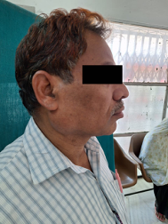
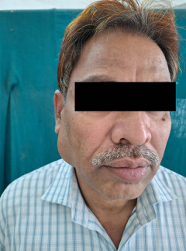
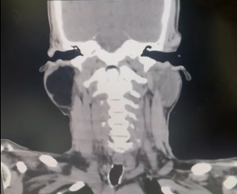
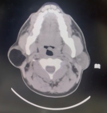

#lipoma

# Abstract

## Background

Lipomas are the most common benign mesenchymal tumors with 15% occurrence in  head and neck region. Intra capsular parotid lipomas are relatively rare comprising 0.6% - 4.4% and diagnosis is difficult. Diagnostic workup is more reliant on CT/MRI and FNAC differing from mainstay of a normal parotid swelling workup. Surgical procedure is challenging due to associated risk of facial nerve injury. We describe a case of 55 year old male with lipoma in superficial and deep lobe of the parotid gland.

## Case Report:

A 55-year-old man presented with a painless, gradually enlarging swelling in the right pre-auricular region for four years. Imaging suggested an intraparotid lipoma, and he underwent superficial parotidectomy with facial nerve preservation. Histopathology confirmed the diagnosis. Postoperatively, his facial nerve function remained intact, and he was discharged after three days with no recurrence at 12-month follow-up.

## Conclusion

Pleomorphic adenomas are the most common parotid gland swellings, while lipomas are rare, making accurate preoperative assessment crucial for proper diagnosis and surgical planning. MRI is the best tool for diagnosis and surgical preparation, though histopathological examination is required for confirmation. Given the risk of facial nerve injury during parotid surgery, surgeons must have significant expertise to ensure positive postoperative functional outcomes.

# Background

Parotid gland is the largest salivary gland located anterior to the external auditory canal, overlying the zygoma superiorly and ramus of the mandible laterally [@kuanEvaluationParotidLesions2016]. Approximately 80% of salivary gland tumors occur in the parotid gland [@bussuClinicalApproachTreatment2011]. Majority of parotid gland tumors are benign, with pleomorphic adenoma being the most common [@alviParotidCancer2024]. Lipoma of the parotid gland is rare, with an average incidence of 4.4% among all parotid malignancies, and a male-to-female ratio of 5:1 [@el-monemLipomasHeadNeck2006]. Lipomas represent the most common mesenchymal tumors of the body, of which majority affect the trunk and upper extremities however, they are uncommon in the head and neck regions. The diagnosis of an intraparotid lipoma can be challenging and often confused with mixed parotid tumors [@payneCaseLipomaParotid1952]. Therefore, a more accurate diagnosis is necessary, which is enabled by improved preoperative evaluation tools such as MRI and FNAC. This case report outlines the diagnosis and surgical approach for a rare parotid region lipoma.

# Case Presentation

A 55-year-old gentleman presented with a painless swelling on his right cheek, below and in front of right ear, which he had for four years. The swelling started gradually and has increased in size. He did not report any tooth pain, and no lumps were found in other areas. There is no relevant medical history or family history of tumors in the head and neck regions.

On local examination, a solitary swelling of about 4 x 3 cm was found in the right pre-auricular region, causing the ear lobule to lift upwards (Fig 1) . The swelling felt firm and was not compressible. The skin over the swelling looked normal, and no other masses in the head and neck area were detected. The examination of the facial nerve showed no abnormalities.

Ultrasound, Fine needle aspiration cytology (FNAC), and CT scan were performed sequentially to establish a pre-operative diagnosis and to plan the best surgical approach. Ultrasound revealed a well-defined iso-hyperechoic lesion measuring 43 x 36 x 23 mm in the parotid region with no internal vascularity. FNAC results showed clusters of mature adipocytes mixed with fibroblasts on a mixed hemorrhagic background. CT scan of the head and neck revealed a well-defined 48 x 38 mm lesion with Hounsfield units (HU) of -100 in the right parotid gland involving the superficial and deep lobes, suggesting an intraparotid lipoma (Fig 2). Since ultrasound was unable to distinguish between the superficial and deep lobe, a CT/MRI should be performed to determine the precise location.

We performed tumor excision via a superficial parotidectomy with facial nerve preservation under general anaesthesia using a modified Blair incision (Fig 3). without causing any significant damage to neurovascular structures.  Intraoperatively a large capsulated soft mass measuring  6 x 5.5 x 2 cm was removed and sent for Histopathological examination, which revealed focal parotid parenchyma with lobules of mature adipocytes separated by fibrous septa, confirming the diagnosis of intraparotid lipoma.

Postoperatively, facial nerve function remained intact (Fig 4). The patient was discharged after 3 days with a smooth recovery. He has been followed up for 12 months with no recurrence of the disease.

# Discussion

Parotid lipomas typically appear as slow-growing, painless masses, mostly affecting only the superficial lobe [@LipomatousLesionsParotid]. The clinical diagnosis is often challenging due to a low index of clinical suspicion. This benign presentation can be mistaken for pleomorphic adenoma or Warthin's tumor. Therefore, a comprehensive preoperative evaluation and additional investigations such as CT/MRI and FNAC should be conducted to confirm the diagnosis before surgery.

Lipomas are typically hyperechoic on ultrasound but sometimes may also be described as iso or hypoechoic making it less specific compared to other imaging modalities [@el-monemLipomasHeadNeck2006]. MRI provides better soft tissue definition, often allowing visualization of the tumor capsule and adipose tissue. Lipomas are T1 hyperintense, whereas pleomorphic adenomas are T2 hyperintense. Therefore, MRI helps differentiate lipomas from parotid neoplasms [@el-monemLipomasHeadNeck2006;@LipomatousLesionsParotid]. The CT scan is equally effective as an MRI, with Hounsfield units ranging from -150 to 50, which are commonly used to diagnose fat [@el-monemLipomasHeadNeck2006;@LipomatousLesionsParotid]. CT scans are less expensive but expose the patient to ionizing radiation, which could be avoided with an MRI.  An essential diagnostic technique for identifying parotid tumors is fine needle aspiration cytology (FNAC). However, its accuracy is only 50% [@santosoLipomaParotidGland2023]. In contrast, FNAC is highly accurate with 96% sensitivity for the diagnosis of lipomas [@chakravartiLipomaDeepLobe2008].

Superficial parotidectomy using Blair’s and modified incision is used to perform the surgical procedure as it provides better access to the gland and the facial nerve, and it is cosmetically better. Deep parotid lobe lipomas are relatively rare and challenging to treat. Most surgeons recommend superficial parotidectomy with facial nerve dissection before excising lesions in the deep lobe [@santosoLipomaParotidGland2023]. Analysis of previous series reveals that around 50% of the reported cases have developed transient or permanent facial weakness postoperatively [@chakravartiLipomaDeepLobe2008]. Therefore, careful dissection of the facial nerve and the use of a facial nerve monitor help safeguard facial nerve function.

# Conclusion

Pleomorphic adenomas represent the most prevalent swellings in the parotid gland, while lipomas are comparatively infrequent. Therefore, a precise preoperative assessment is imperative to confirm the diagnosis before determining the appropriate surgical intervention. The best tool for both diagnosis and surgical planning is MRI, and the definitive diagnosis can only be achieved through histopathological examination.

In the context of parotid surgeries, it is essential for surgeons to possess significant experience and skill, as injuries to the facial nerve are frequently encountered. Therefore, the primary emphasis should be placed on achieving positive postoperative functional outcomes.

